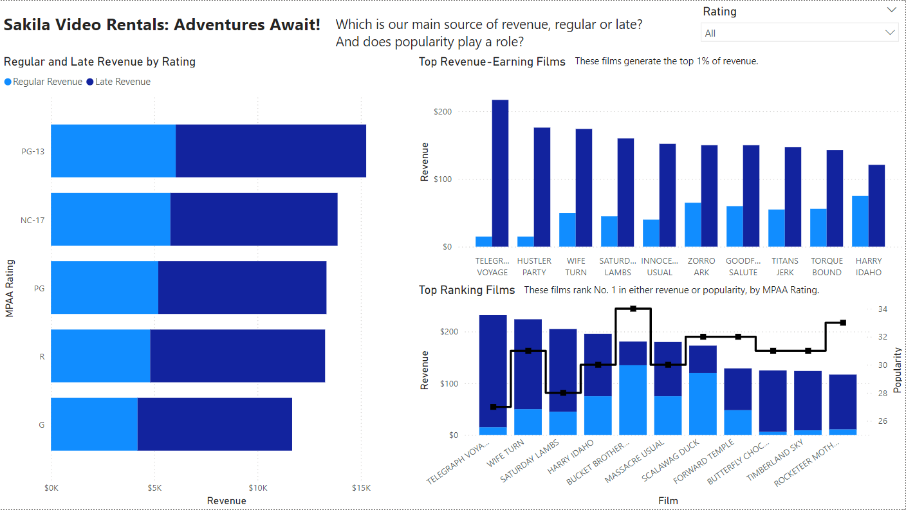

# SQL for Sakila

This is a collaborative personal portfolio project between [Amanda Huang](https://www.linkedin.com/in/amanda-huang9/) and [Ayush Shrestha](https://www.linkedin.com/in/ayush-yoshi-shrestha/). The data analyzed is the Sakila dataset, originally developed by Mike Hillyer of the MySQL AB documentation team and accessible for PostgreSQL [here](https://github.com/jOOQ/sakila).

## Introduction

The dataset is a comprehensive multi-table relational database consisting of 15 tables, designed to capture the global operations of a movie rental store. It includes detailed information on customer demographics and rental activity, as well as payment records and the store's movie inventory across locations.

Although video rental stores are rare in today's market, the principles underlying this analysis remain relevant for many businesses, such as e-commerce platforms and streaming services.

Our goal is to provide Sakila with actionable insights into key revenue drivers, rental patterns, and customer behavior. This includes factors like movie popularity, late returns, and geographic location to help optimize business decisions and strategies. The findings will enable Sakila to make informed decisions on budget allocation for new film acquisitions, maintain optimal inventory levels by predicting late returns, and enhance supply chain efficiency across different regions.

## Methodology

We utilize PostgreSQL to host the database and perform our analysis, employing techniques such as:

- Joins for combining data across multiple tables
- Common Table Expressions (CTEs) for simplifying complex queries
- OLAP (Online Analytical Processing) functions, including Cube, Rank, and Partitioning, for advanced data analysis
- CASE statements for conditional logic within queries

We further leverage Power BI and Tableau to develop dynamic dashboards and visualizations that effectively communicate our key findings. These include:

- Bar charts
- Scatter plots
- Treemaps
- Combo charts

These visualizations enable stakeholders to interact with the data, facilitating deeper understanding and empowering them to refine strategies based on evolving business needs.

## Data Processing & Exploratory Data Analysis (EDA)

Data processing and EDA were conducted using PostgreSQL to prepare the data for more advanced analysis and to gain a comprehensive understanding of the relationships between the tables. The complete Entity Relationship Diagram (ERD) is presented below, serving as a crucial reference that guided our analysis.

Building on the business objectives outlined in the Introduction, the EDA focused primarily on the following tables:

- Film
- Customer
- Country
- Rental
- Payment

These tables provided the foundation for exploring relationships, identifying trends, and uncovering patterns within the dataset. Key observations from the EDA include:

- All films are in the same primary language: English.
- There are two main stores from which customers place rental orders.
- A subset of films has not been returned.
- Late payments are generally higher than the initial rental rate of the movies.

The EDA also highlighted important aspects regarding data quality and usability. While the critical tables for our analysis contained sufficient data, some supplementary tables were relatively sparse and less informative. This can be attributed to the synthetic nature of the dataset but was nonetheless an important insight. For example, there is typically only one customer per city, meaning that aggregating data at the country level is necessary to detect patterns in customer behavior.

With this foundation established, we proceeded to the full analysis.

## Analysis & Findings

We focussed on three broad categories for analysis, each with specific business questions aimed at gaining deeper insights:

**A. Revenue & Popularity:** Exploring the relationship between total revenue, rental volume, and film attributes.

- _Which movies generate the highest revenue? Is this revenue driven by popularity or late fees?_

The dashboard above present a breakdown of revenue by late fees and regular revenue for each MPAA rating, along with a deeper analysis of the films generating the top 1% of revenue and those ranked No. 1 by total revenue or popularity. Key observations include:

- PG-13 and NC-17 movies generate the highest overall revenue.
- Among the films generating the top 1% of revenue, there is a negative correlation between late fees and regular revenue, indicating that films earning higher late fees tend to have lower regular rental revenue.
- There is also a negative correlation between popularity and total revenue for the top-ranking films, suggesting that the most popular films aren't necessarily the most profitable.

When further filtering for PG-13 and NC-17 movies alone, the same negative correlations persist among the top revenue-earning and top-ranking films. This highlights an interesting dynamic where popularity does not always align with profitability, and late fees play a significant role in the revenue of top-grossing films.

- _Which movie categories have the highest popularity and revenue?_

The bar chart visualizes rental volumes across various categories, highlighting the discrepancy between categories that generate the most revenue and those that are the most popular by rental volume.

- Most popular categories (by rental volume): (1) Sports, (2) Animation, (3) Action
- Most lucrative categories (by revenue): (1) Sports, (2) Sci-Fi, (3) Drama

This misalignment suggests that certain categories, despite not having the highest rental volumes, are more profitable due to higher rental rates or increased late fees.

- _Is there any correlation between a movie's length and its popularity, or is it largely influenced by the rental rate?_

The bar chart illustrates the distribution of rental volumes across different film lengths and rental rates, uncovering distinct customer behaviors tied to pricing:

- Films with the lowest rental rate show a relatively even distribution across most film lengths, with the exception of films lasting 180 minutes, which have noticeably fewer rentals. This indicates that customers are generally less selective about film length when paying a lower rate, as affordability seems to be the primary factor driving their rental choices.
- Films with higher rental rates, on the other hand, exhibit a more uneven distribution of rentals, with longer films being rented more frequently. This suggests that customers paying a premium rate are more selective and tend to prefer longer films, likely seeking to maximize their viewing experience.

These patterns reveal that rental rates play a more significant role in influencing customer behavior than film length alone.

**B. Lateness:** Analyzing which movies are more likely to be returned late and the extent of the lateness.

- _Are longer or shorter movies more likely to be returned late? By what magnitude?_

This visualization compares the number of rentals returned late against the total number of rentals across quartiles of film length, alongside the average number of days late for each quartile. The key findings are:

- The proportion of late rentals to total rentals is relatively consistent across all quartiles.
- The average number of days late decreases as film length increases.

This reveals unique customer behavior that runs counter to initial expectations. One might assume that longer films would be returned later due to factors such as requiring multiple sittings to finish watching or needing to schedule a dedicated movie night for the extended viewing. Both scenarios would suggest that longer films would be returned **more** days late, rather than fewer. However, the data shows the opposite trend, indicating that customers may be more diligent about returning longer films on time, possibly to avoid accruing higher late fees.

**C. Customers:** Understanding the distribution of customers by country and store preference, along with store inventory.

- _How many customers are considered loyal? Which store has a higher number of loyal customers, and do they rent more frequently?_

This dashboard offers a clear comparison of customer behavior between Store 1 and Store 2, revealing the following key insights:

- Store 1 has a higher total rental count, indicating a larger customer base. However, its inventory supply is lower, suggesting that Store 1's warehouse may be struggling to meet demand. In contrast, Store 2, despite being less popular and having fewer rentals, plays a vital role in fulfilling inventory needs as it holds a larger stock of available rentals.

- By utilizing the interactive filter function, we can compare the proportions of loyal customers (those with rentals above the average across all customers) between the two stores. Although the proportions of loyal customers are similar for both stores, Store 2 has a notably higher proportion of "super loyal" customers (those with significantly more rentals). This indicates that while Store 2 has a smaller customer base, its stronger relationships with loyal customers present an opportunity for deeper engagement and retention strategies.

- _Where are our active customers located geographically? How much revenue and rental volume do they bring to the company?_

This dashboard provides an overview of revenue and rental volume from each country represented in our customer base, as well as how many customers engage with each store. Key initial findings include:

- India, China, and the United States (in that order) generate the most revenue and rentals across both stores.
- More customers interact with Store 1 than Store 2.

When filtering for Store 1, India, China, and the United States remain the top markets in terms of both revenue and customer interaction.

When filtering for Store 2, China, India, and Mexico are the top markets, with the United States ranking closely behind Mexico.

Utilizing dynamic filtering, we identify that:

- China and India are critical markets driving performance for both Store 1 and Store 2.
- The United States is equally important to the success of both stores.
- Mexico plays a more significant role in Store 2's success than in Store 1.

These insights highlight the geographic differences in customer behavior and market importance between the two stores, which can inform targeted business strategies by location.

## Recommendations

With the wealth of findings uncovered, we can offer the following recommendations to Sakila for each defined business area.

**Revenue & Popularity**:

_Focus on PG-13 and NC-17 Movies_: Since PG-13 and NC-17 movies generate the highest overall revenue, Sakila should prioritize marketing and inventory stocking for these categories. The following strategies can be employed to capitalize on their profitability:
- **Exclusive Collections**: Create curated collections of popular PG-13 and NC-17 films (e.g., "Top-Grossing PG-13 Hits" or "NC-17 Cult Classics") to attract more customers and highlight these high-revenue categories.
- **Stock Optimization**: Ensure adequate inventory for PG-13 and NC-17 films to meet demand, particularly for new releases or popular titles.

_Capitalize on High-Revenue, Low-Volume Genres_: Categories like Sci-Fi and Drama, while not the most popular, generate significant revenue. To enhance profitability from these genres, Sakila can adopt the following strategies:
- **Targeted Discounts**: Offer special discounts or promotional pricing on Sci-Fi and Drama films, particularly for high-revenue titles. Promotions such as "Sci-Fi Sundays" or "Drama Discounts" could incentivize customers to explore these less-rented but profitable categories.
- **Loyalty Program Perks**: Introduce exclusive perks within the loyalty program for renting Sci-Fi and Drama films. For example, double reward points or bonus credits for customers who rent multiple films in these genres would encourage more frequent rentals.

**Lateness**:

_Timely Returns_: Given the discrepancy in the average days late based on film length, Sakila should introduce a timely-return incentive program to encourage customers to return films on time, especially for shorter films. This could include:
- **Point System or Rental Credit**: Customers earn points or credits for each timely return, which can be redeemed for discounts on future rentals. This system would motivate customers to return films promptly, reducing late returns and easing inventory bottlenecks.
- **Bonus for Shorter Films**: Offer additional points or credits for returning shorter films on time, as these are often returned later than expected. This targeted incentive would help mitigate the issue of shorter films being held longer than necessary.

**Customer & Store**:

Inventory Optimization Between Stores: Store 1 has a larger customer base but struggles with inventory shortages, while Store 2 holds more inventory but has fewer rentals. To optimize resources, a more dynamic inventory-sharing system should be implemented to redistribute films between stores based on demand. This could reduce stockouts in Store 1 and boost utilization of Store 2’s surplus inventory.

Engage and Retain Loyal Customers at Store 2: Store 2’s smaller yet highly loyal customer base represents an opportunity for deeper engagement. Implement loyalty programs or exclusive offers for "super loyal" customers to retain and expand their rental activity, which could help Store 2 close the gap with Store 1 in terms of overall rental volume.

Tailor Marketing by Region:
- China and India are critical markets for both stores, so maintaining a steady supply of popular films and targeted promotions in these countries is essential.
- The United States is a key market for both stores and should be treated as equally important in marketing and inventory strategies
- Mexico’s importance to Store 2 indicates an opportunity to launch targeted campaigns and regional incentives that cater to Mexican customers’ preferences, further increasing Store 2’s rental volume.